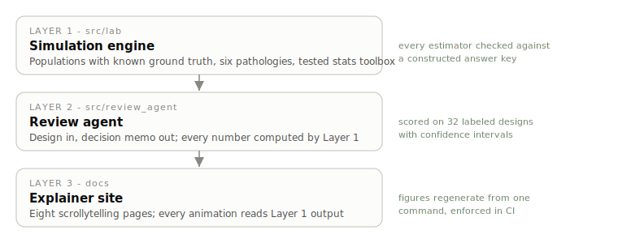

# Experimentation Lab

Every A/B test platform will tell you your p-value. None of them can tell
you whether your correction for peeking actually worked, because real
experiment data has no answer key: you never observe the true effect you
were estimating. This repository fixes that by cheating. It simulates user
populations where the true treatment effect is set by construction, breaks
experiments on them the six ways experiments break in production, and
measures the damage against the truth. Daily significance checking turns a
5% false positive rate into 24%. A two-week readout of a novelty effect
overstates the launch impact by 3x. A rank test on revenue misses a third
of real wins. Each number regenerates from committed, tested code with one
command.

**The explainers:** https://bhushitn.github.io/experimentation-lab/



## Quickstart

The site needs nothing; the code needs Python 3.11+.

```bash
git clone https://github.com/bhushitn/experimentation-lab.git
cd experimentation-lab
pip install -e ".[dev]"
pytest tests/ -q                                    # 56 tests, ~15 seconds
PYTHONPATH=src python scripts/regenerate_figures.py # every figure, from seeds
```

## What the simulations measure

All effects and error rates below are measured against ground truth that the
simulator fixed in advance. Brackets are 95% Wilson intervals; runs are
seeded and reproduced by CI on every push.

| Pathology | Naive analysis | Corrected analysis | Runs |
|---|---|---|---|
| Peeking (14 daily looks, no true effect) | 24.1% false positives [22.8, 25.4] | 5.0% [4.3, 5.7] with a Lan-DeMets O'Brien-Fleming boundary | 4,000 |
| Multiple comparisons (20 metrics, all null) | 62.9% of experiments show a false winner [61.4, 64.4] | 4.8% [4.2, 5.5] under Benjamini-Hochberg | 4,000 |
| Subgroup fishing (20 null segments) | 63.8% find a "significant" subgroup [62.3, 65.3] | 5.0% with one pre-registered segment | 4,000 |
| Contamination (20%/10% two-sided, true effect 0.50) | per-protocol reads 0.85; ITT attenuates to 0.38 | IV/Wald recovers 0.54 | closed-form check |
| Network interference (true launch effect 0.80) | user-level randomization reads 0.52 | cluster randomization reads 0.83 | exact identity check |
| Novelty (long-run effect 0.10) | week-1 readout: 0.32, a 3.2x overstatement | post-burn-in window: 0.13 | analytic check |
| Test choice (zero-inflated revenue, +25% spend effect) | Mann-Whitney power 68% [61.2, 74.1] | Welch t power 100% [98.1, 100] | 200 |
| CUPED (28-day pre-period covariate) | plain Welch CI width 0.105 | 0.075, a 48.4% variance cut matching the analytic 48.3% | exact check |

The statistical toolbox behind these (Welch t, two-proportion z, chi-square,
Mann-Whitney U, CUPED, bootstrap CIs, power/MDE, alpha-spending boundaries,
Bonferroni and BH) is implemented from the formulas and validated in unit
tests against scipy, statsmodels, and published Lan-DeMets boundary tables.
Correctness is a test suite here, not a claim.

## The review agent

The second layer turns the simulations into an operating tool: a single
structured-output agent (Anthropic API, Pydantic-validated) that takes an
experiment design and returns a review memo in the format a launch review
actually uses: recommendation first, each threat to validity quantified by
the simulation that measures it, then the analysis plan. The agent never
does arithmetic; a deterministic evidence pack computes every number it may
cite.

It is evaluated on 32 labeled designs (8 clean, 24 flawed) whose labels are
correct by construction. The committed reference run scores micro
precision and recall of 1.00 [0.90, 1.00] over 36 flaw instances; the flaws
are constructed to be detectable, so treat that as a demonstration of the
harness, and rerun it against any model with your own key:

```bash
export ANTHROPIC_API_KEY=your-key   # see .env.example
python eval/harness.py --live
```

## Design decisions

Full record with rejected alternatives in [DECISIONS.md](DECISIONS.md). The
three that shape everything:

**Synthetic data, on purpose.** Real company experiment data would be a
liability to publish and, worse, useless for this goal: with no known truth,
you can show a correction changes the number but never that it fixes it.
Simulation inverts that. It is the difference between "the boundary looked
reasonable" and "the boundary held the family-wise error at 4.95% over
4,000 runs where I knew the answer."

**Alpha spending over always-valid inference.** The sequential method is
Lan-DeMets with an O'Brien-Fleming-type spending function because it can be
validated against published boundary tables, and this repository's rule is
that nothing ships unverified. mSPRT is noted as further reading.

**One agent, not an agent graph.** Reviewing a design is a one-pass task
with no decomposition benefit. A planner-critic-reviewer pipeline here would
be architecture as decoration.

## Scope

Everything is synthetic and the product scenarios describe a fictional
short-video app. This is an educational and interview-preparation artifact,
not an experimentation platform; if you need one of those, that is
Optimizely, Statsig, or Eppo. What this repository offers that they do not
is the answer key.

## Using this for interview prep

Experimentation interviews at product companies probe four skills: design a
valid test, recognize a broken one, quantify the damage, and write the
recommendation. Each explainer is one interview question in disguise, and
ends with the memo you would write. A workable drill: read a pathology page
until the setup, close it, write your own answer to "what goes wrong and by
how much", then check yourself against the measured number and the memo.
The gallery notebook (`notebooks/02_pathology_gallery.ipynb`) is the same
content with the code in front of you.

## Repository map

```
src/lab/            engine: populations, assignment, pathologies, stats, reporting
src/review_agent/   the memo-writing agent and its versioned prompt
eval/               labeled designs, harness, metrics
notebooks/          executed walkthroughs (regenerate: scripts/build_notebooks.py)
docs/               the site, its data, and every figure
tests/              unit (reference validation) and integration (ground truth)
```

MIT licensed. Issues and corrections welcome; see
[CONTRIBUTING.md](CONTRIBUTING.md).
